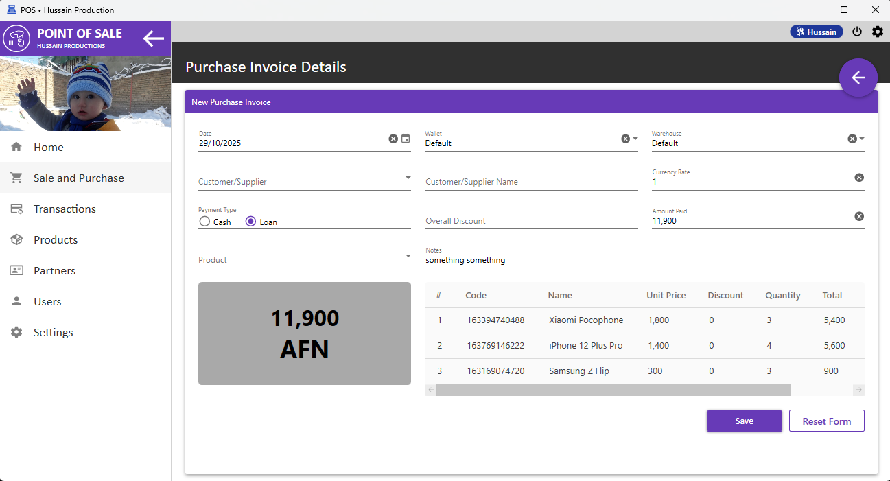

## Point of Sale

This is a project to demonstrate my WPF coding skills. The project is under development. I have developed this project in C# and I have used following tools and techniques in this project:  
- SQLite as DBMS for the purpose of simplicity and portability
- Entity Framework Core as ORM
- MVVM pattern and two way data binding for separating UI from business logic
- Material Design Themes as UI library
- FluentValidation for easy and robust validation
- AutoMapper for easy and consolidated object mapping  
The POS project contains the following modules:  
- Product registration
- Sale and purchases
- Financial transactions
- Partner registration
- User management
- Settings
